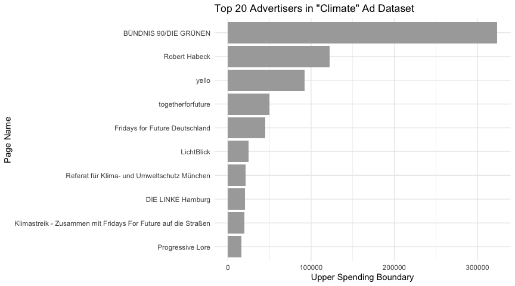

<LevelChip level="Intermediate" />
<PlatformChip platform="Meta"/>
<LanguageChip lang="R"/>


<AuthorCard
  name="Fabio Votta"
  avatar="FV"
  avatarSrc={require("@site/static/img/contributors/votta.jpg").default}
  position="ASCoR | University of Amsterdam"
  website="https://www.favstats.eu/"
  bluesky="https://bsky.app/profile/favstats.eu"
  linkedin="https://www.linkedin.com/in/dr-fabio-votta-81a862131"
/>

<LastUpdatedByChip authorOriginal="Fabio Votta" createdOn="30.07.2025" />

## Introduction

Meta’s Ad Library provides a public record of ads that run on Facebook
and Instagram. Researchers, journalists, and civic watchdogs can use
this data to analyze advertising trends, for example, tracking political
campaign ads, spending, and the reached demographics. The Meta Ad
Library API offers programmatic access to these ads, enabling retrieval
of detailed ad content and performance information. Each ad entry
includes metadata such as the ad’s text, the advertiser’s page, the time
period it ran, the amount spent (as a range), impressions delivered
(also as a range), and breakdowns of the audience by age, gender, and
region. Importantly, many metrics are given as ranges (min–max) rather
than precise values. 

This tutorial will demonstrate how to use R (with
the `tidyverse` ecosystem) and the `Radlibrary` R package to access the
Meta Ad Library via its official API. We will walk through obtaining API
access, constructing queries to find ads (by keyword or page id),
retrieving ad data, and performing analyses such as ad volume and spend
over time, top advertisers, and demographic targeting patterns.

### Step 1: Setting Up API Access (Verification & Developer Account)

Before writing any code, you need to secure access to the Ad Library
API. Meta requires a few one-time setup steps:

1.  **Confirm your identity and location**: Facebook mandates an [ID
    verification process](https://www.facebook.com/id/hub) for anyone
    accessing political ad data (the same process required to run
    political ads). You will need to provide a government ID and proof
    of your country. This can take 1–2 days for approval.


2.  **Create a Facebook Developer account**: Go to the Facebook for
    Developers portal and sign up with your Facebook account (if you
    haven’t already). Agree to any platform policies as needed. Once you
    have a developer account, create a new “App” in the dashboard
    (choose Business or Custom app type for this
    purpose). This app is just a container to obtain API credentials.

3.  **Generate an access token**: The Ad Library API is accessed via
    Meta’s Graph API. The simplest way to get a token is by using the
    [Graph API Explorer](https://developers.facebook.com/tools/explorer)
    tool. Once you are on the Graph API Explorer page, generate a user
    access token. You need to add the permission `ads_read` in the token
    generation dialog so that the token is authorized to query the ads
    archive. Once generated, copy this token for use in R. Keep it
    confidential and treat it like a password – anyone with this token
    could potentially query the API on your behalf until it expires.

:::hub-note Note
**Token expiration:** By default, tokens from the Explorer are [short-lived](https://developers.facebook.com/docs/facebook-login/guides/access-tokens#termtokens)(usually ~1-2 hours). For short analysis sessions that might be
sufficient, but in most cases you will likely need longer access. You can exchange the short-lived token for a 60-day token using your App’s App ID and App Secret. In this tutorial, we will proceed with a short-lived token for simplicity, but it is strongly encouraged to get a long-term token for your analysis (holds for 60 days). For instructions on how to do this, refer to the [official Meta documentation on access tokens](https://facebookresearch.github.io/Radlibrary/articles/Radlibrary.html#generating-persistent-tokens).
:::

### Step 2: Installing and Loading R Packages

We will use an R package called `Radlibrary` (by Meta’s Facebook
Research team) to interact with the Ad Library API. `Radlibrary` is a
convenient wrapper that handles authentication and query construction,
saving us from crafting raw Graph API calls (which we could also do if
we feel fancy like that). It also helps format results into tidy data
frames. In addition, we will use the `tidyverse` for data manipulation
(`dplyr`, `tidyr`) and `ggplot2` for visualization. Finally, we will use
my very own package,
[`metatargetr`](www.github.com/favstats/metatargetr) to retrieve some ad
spending data. If you haven’t installed these packages, do so first:

``` r
# Install Radlibrary from GitHub (it’s not on CRAN as of writing)
if(!("pak" %in% installed.packages())){
  install.packages("pak")  # if devtools not already installed
}
```

``` r
# Install Radlibrary
pak::pak("facebookresearch/Radlibrary")
# Install metatargetr
pak::pak("favstats/metatargetr")
# Install lubridate 
pak::pak("lubridate")
# Install tidyverse if not already (includes dplyr, ggplot2, etc.)
pak::pak("tidyverse")
```

``` r
# Load the libraries in your R session
library(Radlibrary)
library(metatargetr)
library(lubridate)  # for convenient date functions
library(tidyverse)
```

Make sure `Radlibrary` installed successfully (you might need to update
Rtools on Windows or install additional library on Linux distributions).
Now you are ready to use the Meta Ad Library API in R!

### Step 3: Authenticating with your Access Token

With your user access token in hand (from Step 1), you need to provide
it to `Radlibrary` so it can authenticate API requests. **As a general
rule, never hard-code the token directly in scripts.** One safe approach
is to use R’s readline() function to paste the token interactively (this
avoids storing it in your R command history):

``` r
# Prompt for the token (paste your token string at the prompt that appears)
token <- readline(prompt = "Enter your Facebook API access token: ")
```

When you run this, R will pause and let you paste the token. Hit Enter
and it will be stored in the token variable for use. This method ensures
the token is not visible in your script or R history.

**Optionally:**

You can also save the token as an environment variable like this:

``` r
# Set the token as an environment variable
Sys.setenv(META_API_TOKEN = token)
```

Now, in the rest of your script, you can retrieve your token like this
*but only after you have restarted your R session*:

``` r
token <- Sys.getenv("META_API_TOKEN")
```
## Querying the Ad Library API

### Step 4: Building a Query to the Ad Library API (`adlib_build_query`)

Now we get to the moment we have been waiting for – how to get the data!
The Ad Library API requires specifying what ads you want to retrieve.
This is done by constructing a query with various parameters. The
`Radlibrary` function `adlib_build_query()` helps create this query
object.

We will start with a simple example scenario: Suppose we want to find
ads related to the climate in the runup to the 2025 German parliamentary
elections. We are interested in all such ads (whether currently active
or inactive) that were shown three weeks before election day but only
those that were classified or self-identified as political or issue ads.

First, we specifiy a list of all the variables that we would like to
retrieve, here I use all available variables as of June 2025.

``` r
## First we 
ad_fields <- c(
    ## some meta info and unique identifier
    "page_id", "page_name",# "id", # id is added automatically
    ## general info, text, description, run times
    "ad_creation_time", "ad_delivery_start_time", "ad_delivery_stop_time", 
    "ad_creative_bodies", "ad_creative_link_captions", "ad_creative_link_descriptions",
    "ad_creative_link_titles",  "ad_snapshot_url", "languages", "publisher_platforms",
    ## spending info
    "currency",  "spend", "bylines", "beneficiary_payers",
    ## delivery and reach
    "delivery_by_region",  "demographic_distribution",
    "estimated_audience_size", "impressions",
    # "br_total_reach", # unique reach (only available for Brazil)
    ## EU only
    "eu_total_reach", "age_country_gender_reach_breakdown",
    "target_ages", "target_gender",  "target_locations"
)
```

Now we are ready to build the query step by step:

``` r
# Build an Ad Library API query for ads related to "climate" in Germany during 2025 election
query <- adlib_build_query(
  ad_reached_countries = "DE",          # country where ads were delivered
  ad_delivery_date_min = "2025-02-03",  # specify minimum date: 21 days before election day
  ad_delivery_date_max = "2025-02-23",  # specify maximum date: election day
  ad_active_status    = "ALL",          # include both active and inactive ads 
  search_terms        = "klima", # keywords to search in ad text or metadata
  ad_type             = "POLITICAL_AND_ISSUE_ADS",  # restrict to political/issue ads
  fields              = ad_fields,  # data fields we want
  limit               = 200            # number of results per page (max 1000)
)
```

:::hub-note Note
You might encounter the following warning: *Warning: Unsupported fields supplied:* followed by a list of parameters. This warning can be safely ignored. The `Radlibrary` package, despite being developed by the Facebook team, may not be up to date with the newest parameters.
:::

------------------------------------------------------------------------

#### Parameter Breakdown

Let us unpack the parameters used in the API query (and some additional
ones):

<details>
  <summary>**`ad_reached_countries`**  
  Specifies the countries where the ads were delivered.</summary>

  For example, setting this to `"DE"` retrieves ads delivered in
  Germany.  
  At least one country code must be specified. Multiple countries can be
  provided as a vector, e.g., `c("US", "CA")`.
</details>


<details>
  <summary>**`ad_delivery_date_min`** and  **`ad_delivery_date_max`**  
  Define the date range for when the ads were delivered.</summary>
  
The format should be `"YYYY-MM-DD"`.  
For instance, setting `ad_delivery_date_min = "2025-02-22"` and  
`ad_delivery_date_max = "2025-02-23"` retrieves ads delivered between  
February 22 and February 23, 2025.
</details>

<details>
<summary> **`ad_active_status`** determines the delivery status of the ads to retrieve.</summary>

If not specified, the default is `"ACTIVE"`, which returns only  
currently active ads.  
For historical analysis, setting this to `"ALL"` retrieves both active  
and inactive ads.

Valid values:
- `"ALL"`: all ads, past and present  
- `"ACTIVE"`: only currently running ads  
- `"INACTIVE"`: only ads that have stopped running  
</details>

<details>
<summary> **`search_terms`** is a keyword or phrase to search within the ad’s content, title, or disclaimer text.</summary>

The API treats a blank space as a logical `AND` and searches for both  
terms without other operators.  
For example, `"climate change"` is interpreted as `"climate"` AND  
`"change"`.  
To search for an exact phrase, use the `search_type` parameter set to  
`"KEYWORD_EXACT_PHRASE"`.
</details>

<details>
<summary> **`search_page_ids`** is an optional alternative to `search_terms` and retrieves ads from a specific Facebook Page.</summary>

Provide the numeric Page ID (e.g., `"1234567890"`).  
This is ideal when focusing on a particular advertiser’s metadata and  
content.  

You can find page IDs via:
- The Ad Library API (just query it by `search_terms` as we show below and take note of a page id of interest).
- Download spending reports in the [Ad Library Report](https://www.facebook.com/ads/library/report/) which includes spending by page id.
- In the URL of an Ad Library page, i.e. after the `view_all_page_id` URL parameter. For example:  
  [https://www.facebook.com/ads/library/?view_all_page_id=179587888720522](https://www.facebook.com/ads/library/?view_all_page_id=179587888720522) is the Ad Library Page for the U.S. Department of Homeland Security and *179587888720522* is the page id.
</details>

<details>
<summary> **`ad_type`** specifies the category of ads to retrieve.</summary>

Valid values include:
- `"ALL"`: Retrieves all ads, regardless of category.  
- `"POLITICAL_AND_ISSUE_ADS"`  
- `"EMPLOYMENT_ADS"`  
- `"HOUSING_ADS"`  
- `"FINANCIAL_PRODUCTS_AND_SERVICES_ADS"`  
</details>

<details>
<summary> **`fields`** determines what information about each ad will be returned.</summary>

In our example, we request specific fields defined in the `ad_fields`  
variable.  
The fields are categorized as follows:

- **Meta Information and Identifiers**:
  - `"page_id"`: Unique identifier for the Facebook Page.  
  - `"page_name"`: Name of the Facebook Page.
- **General Information**:
  - `"ad_creation_time"`: Time when the ad was created.  
  - `"ad_delivery_start_time"`: Start time of the ad delivery.  
  - `"ad_delivery_stop_time"`: Stop time of the ad delivery.  
  - `"ad_creative_bodies"`: Main text content of the ad.  
  - `"ad_creative_link_captions"`: Captions in the call-to-action section.  
  - `"ad_creative_link_descriptions"`: Descriptions in the call-to-action section.  
  - `"ad_creative_link_titles"`: Titles in the call-to-action section.  
  - `"ad_snapshot_url"`: URL to a snapshot of the ad.  
  - `"languages"`: Languages used in the ad.  
  - `"publisher_platforms"`: Platforms where the ad was published (e.g., Facebook, Instagram).
- **Spending Information**:
  - `"currency"`: Currency used for the ad spend.  
  - `"spend"`: Amount spent on the ad.  
  - `"bylines"`: Bylines associated with the ad.  
  - `"beneficiary_payers"`: Entities that paid for the ad.
- **Delivery and Reach**:
  - `"delivery_by_region"`: Regional delivery information.  
  - `"demographic_distribution"`: Demographic breakdown of the ad’s audience.  
  - `"estimated_audience_size"`: Estimated size of the audience.  
  - `"impressions"`: Number of times the ad was displayed.
- **EU-Specific Fields**:
  - `"eu_total_reach"`: Total reach within the European Union.  
  - `"age_country_gender_reach_breakdown"`: Breakdown of reach by age, country, and gender.  
  - `"target_ages"`: Targeted age groups.  
  - `"target_gender"`: Targeted genders.  
  - `"target_locations"`: Targeted locations.

These fields provide comprehensive information about each ad, including  
its content, delivery, and audience targeting. For more info, you can  
check the [Meta Ad Library API documentation](https://www.facebook.com/ads/library/api/).
</details>

<details>
<summary> **`limit`** limits the number of results per API call.</summary>

The default value is 25, and the maximum is 1,000.  
If your query could return more, you will need to paginate (more about  
that later).  
For now, we assume `100` is sufficient for demonstration purposes.
</details>

------------------------------------------------------------------------

#### Next Step

At this point, we have only created a **query object**, a structured
list containing all parameters. **The query has not yet been sent** to
Meta.

The function `adlib_build_query()` only constructs the query. You can
inspect it by printing `query`, which will show its components and the
exact URL to be called.

Let us now proceed to **fetch the data**.

### Step 5: Retrieving Ad Data from the API (`adlib_get`)

To execute the query and get results, we use `Radlibrary`’s function
`adlib_get()`. This function takes our query and the access token, sends
the request to Meta’s Graph API, and returns the response. Let’s call
it:

``` r
# Execute the query and retrieve data
result <- adlib_get(query, token = token)
```

Under the hood, this hits the Graph API’s /ads_archive endpoint with all
the parameters we specified. The result we get back is an object of
class `adlib_data_response`. It contains the data and some metadata.

``` r
glimpse(result$data[[1]], max.level = 1)
```
```
     $ id                                : chr "547343151714655"
     $ page_id                           : chr "530858850114749"
     $ page_name                         : chr "Undone Work GmbH"
     $ ad_creation_time                  : chr "2025-02-23"
     $ ad_delivery_start_time            : chr "2025-02-23"
     $ ad_delivery_stop_time             : chr "2025-02-28"
     $ ad_creative_bodies                :List of 1
     $ ad_creative_link_captions         :List of 1
     $ ad_snapshot_url                   : chr "https://www.facebook.com/ads/archive/render_ad/?id=547343151714655&access_token=XXXX"| __truncated__
     $ languages                         :List of 1
     $ publisher_platforms               :List of 1
     $ currency                          : chr "EUR"
     $ spend                             :List of 2
     $ bylines                           : chr "Undone Work GmbH"
     $ beneficiary_payers                :List of 1
     $ delivery_by_region                :List of 16
     $ demographic_distribution          :List of 15
     $ estimated_audience_size           :List of 1
     $ impressions                       :List of 2
     $ eu_total_reach                    : int 616
     $ age_country_gender_reach_breakdown:List of 1
     $ target_ages                       :List of 2
     $ target_gender                     : chr "All"
     $ target_locations                  :List of 1
```

Now that result is in hand, let’s convert it into a more
analysis-friendly format.

### Step 6: Converting to a Tidy Data Frame

Radlibrary provides an S3 method to turn the result into a tibble (a
tidyverse-friendly data frame). We simply use as_tibble():

``` r
ads_df <- as_tibble(result, censor_access_token = TRUE)
```

By default, we include `censor_access_token = TRUE` to strip out the
token from any embedded URLs in the data (this is a safety measure so we
don’t accidentally reveal our token when inspecting data). Now `ads_df`
is a tibble where each row is one ad and each column is a variable
returned by the API.

If you want to check the columns, try `glimpse(ads_df)` or
`names(ads_df)` to inspect the structure of the `ads_df` data frame.
Some of the key columns include: - `impressions_lower`,
`impressions_upper`: The estimated range of impressions delivered. -
`spend_lower`, `spend_upper`: The estimated range of ad spend in the
currency used - `demographic_distribution`: A so-called list-column
containing, for each ad, a data frame of demographic percentages (since
we asked for it). We will explore how to work with this column in Step
9.

### Step 7: Handling Pagination for Larger Datasets (`paginate_meta_api`)

The Meta Ad Library API returns only a limited number of ads per
request. To retrieve more than the default amount, you need to handle
pagination by following the `next_page` links provided in the API
response.

While the `Radlibrary` package offers the `adlib_get_paginated()`
function to assist with pagination, it unfortunately does NOT handle
rate limiting or delays between requests. To address this, I have
implemented a custom function, `paginate_meta_api()`, which automates
pagination and includes logic to manage API rate limits by introducing
appropriate delays between requests. Specify `max_pages`, i.e. how many
iterations you want to go through and also whether it should print
update while retrieving data `verbose = TRUE`, and API usage limits
`api_health = TRUE` (by default `FALSE`).

Here is how you can use the custom function:

``` r
# Load the custom pagination function
source("https://gist.githubusercontent.com/favstats/ac37f6a7c881dddfa1c156bfb3e2dbdf/raw/b49e3f73881a4595309480e418658e018fbd0980/paginate_meta_api.R")

# Retrieve all pages with delay logic
climate_ads <- paginate_meta_api(query, token, max_pages = 100, verbose = FALSE, api_health = FALSE)
```

At this stage, we have a data frame `climate_ads` of all retrieved ads
and their metadata. We can now perform analysis on this data. Let us
tackle a few common analysis tasks one by one.

## Analzing the Data

### Step 8: Analyzing Ad Volume and Top Advertisers

A basic question is how the number of ads changes
over time. For example, did advertising surge closer to election day? We
can visualize the number of ads in our dataset by date by using the ad
delivery start date as the date an ad “entered” the library (since if an
ad is active for multiple days, it is counted on the first day it ran).
Let us create a time series of ad count by day:

``` r
climate_ads %>%
  mutate(start_date = as.Date(ad_delivery_start_time)) %>%   # extract date portion
  count(start_date) %>%
  ggplot(aes(x = start_date, y = n)) +
  geom_line(color = "steelblue") +
  labs(x = "Date", y = "Number of Ads Started", 
       title = "Daily Count of New Ads in Ad Library (\"climate\" query in Germany)") +
  theme_minimal()
```


This code groups ads by their start date and counts them, then plots a
line graph. The result shows that we retrieved much more data than we
had specified. This sometimes happens – the API is not perfect. We
filter to include only data within the specified timeframe.

``` r
climate_ads %>%
  mutate(start_date = as.Date(ad_delivery_start_time)) %>%   # extract date portion
  count(start_date) %>%
  filter(start_date >= as.Date("2025-02-03")) %>% 
  ggplot(aes(x = start_date, y = n)) +
  geom_line(color = "darkgreen") +
  labs(x = "Date", y = "Number of Ads Started", 
       title = "Daily Count of New Ads in Ad Library (\"climate\" query in Germany)") +
  theme_minimal()
```


Another limitation with counting ads is that the ads listed in the ad
library do not represent unique ads, but rather ad runs. If an
advertiser runs the same ad again with some changes in settings, it will
be counted as a separate ad. This may overinflate the number of unique
ads. One possible way to address this is to filter for unique texts
(e.g. `ad_creative_bodies`).

Another approach is to aggregate by spending, which gives a sense of
where the advertiser’s focus lies.

``` r
climate_ads %>%
  mutate(keyword = "climate") %>% 
  mutate(start_date = as.Date(ad_delivery_start_time)) %>%   # extract date portion
  group_by(start_date,keyword) %>% 
  summarize(spend_lower = sum(spend_lower),
            spend_upper = sum(spend_upper)) %>% 
  ungroup() %>% 
  rowwise() %>% 
  mutate(spend_mid = median(c(spend_lower, spend_upper))) %>% 
  filter(start_date >= as.Date("2025-02-03")) %>% 
  ggplot(aes(x = start_date, y = spend_mid, color = keyword)) +
  geom_ribbon(aes(ymin = spend_lower, ymax = spend_upper), alpha = 0.1, linetype = "blank") +
  geom_line() +
  labs(x = "Date", y = "Daily Ad Spending in Euro", 
       title = "Daily Spending on Ads in Ad Library (\"climate\" query in Germany)") +
  theme_minimal() +
  scale_color_manual(values = c( "darkgreen")) +
  theme(legend.position = "bottom")
```


#### Who is advertising on the climate topic?

Another common analysis is to identify which organizations or pages are
running the most ads in your data. We can easily rank advertisers by the
number of ads:

``` r
climate_ads  %>% 
  group_by(page_name) %>% 
  dplyr::summarize(spend_upper = sum(spend_upper)) %>%
  ungroup() %>% 
  arrange(desc(spend_upper)) %>% 
  slice(1:10) %>% 
  mutate(page_name =fct_reorder(page_name, spend_upper)) %>% 
  ggplot(aes(x = page_name, y = spend_upper)) +
  geom_col(fill="darkgray") +
  coord_flip() +   # flip for horizontal bars (easier to read names)
  labs(x = "Page Name", y = "Upper Spending Boundary",
       title = "Top 20 Advertisers in \"Climate\" Ad Dataset") +
  theme_minimal()
```




Given that search terms sometimes are a bit unpredictable and don’t
always work as expected, we can also query the top 10 advertisers based
on spending. We can do so by retrieving the spending reports from Meta,
conveniently archived by the
[`metatargetr`](www.github.com/favstats/metatargetr) package. For a full tutorial on `metatargetr` and its capabilities [see this tutorial](https://data-knowledge-hub.com/docs/data-analysis/04_05_metatargetr).

``` r
spending_report <- get_report_db("DE", timeframe = 30, ds = "2025-02-23")

national_parties <- spending_report %>% 
  filter(page_name %in% c("Die Linke", "SPD", "BÜNDNIS 90/DIE GRÜNEN", "FDP", "CDU", "AfD"))
  
# Build an Ad Library API query for ads related to "climate" in Germany during 2025 election
query <- adlib_build_query(
  ad_reached_countries = "DE",          # country where ads were delivered
  ad_delivery_date_min = "2025-02-03",  # specify minimum date: 21 days before election day
  ad_delivery_date_max = "2025-02-23",  # specify maximum date: election day
  ad_active_status    = "ALL",          # include both active and inactive ads 
  search_page_ids     = national_parties$page_id, # search page IDs, up to 10 at once
  ad_type             = "POLITICAL_AND_ISSUE_ADS",  # restrict to political/issue ads
  fields              = ad_fields,  # data fields we want
  limit               = 200            # number of results per page (max 1000)
)

top_ads <- paginate_meta_api(query, token, max_pages = 100, verbose = TRUE, api_health = TRUE)
```

We are going to visualize some of the text included inside the ad data
by creating a *chatter plot*. For that, we also need some additional
packages listed below.

``` r
pak::pak("tidytext")
pak::pak("stopwords")
pak::pak("ggrepel")
```

``` r
# Define party colors
party_colors <- c(
  "Die Linke" = "#BE3075",
  "SPD" = "#E3000F",
  "BÜNDNIS 90/DIE GRÜNEN" = "#64A12D",
  "FDP" = "#FFED00",
  "CDU" = "#000000",
  "AfD" = "#009EE0"
)
# Tokenize ad texts and count word frequencies
top_ads %>%
  unnest(ad_creative_bodies) %>%
  tidytext::unnest_tokens(word, ad_creative_bodies) %>%
  filter(!is.na(word)) %>%
  anti_join(tibble(word = stopwords::stopwords("de")), by = "word") %>%
  # Select top 30 words per party
  count(page_name, word, sort = TRUE)  %>%
  group_by(page_name) %>%
  top_n(30, n) %>%
  ungroup() %>% 
  mutate(page_name = fct_relevel(page_name,
                                 c("Die Linke", "SPD",
                                   "BÜNDNIS 90/DIE GRÜNEN", 
                                   "FDP", "CDU", "AfD"))) %>% 
  # Create the chatter plot
  ggplot(aes(x = page_name, y = n, label = word, color = page_name)) +
  # geom_point(alpha = 0.7) +
  ggrepel::geom_text_repel(
    force = 5,
    box.padding = 0.1,
    max.overlaps = Inf,
    segment.color = NA,  # This removes the lines
    size = 3
  ) +  
  labs(
    x = "Political Party (Left to Right)",
    y = "Word Frequency",
    title = "Common Words in Political Ads by Party"
  ) +
  scale_color_manual(values = party_colors) +
  theme_minimal() +
  scale_y_log10() +
  theme(legend.position = "none")
```


This chatter plot visualizes the most frequent words found in the ads of
Germany’s major political parties. The parties are arranged along the
x-axis according to their position on the political spectrum, from left
to right. The y-axis represents the frequency of each word on a
logarithmic scale, which helps visualize words with a wide range of
frequencies. This type of analysis allows us to quickly grasp the key
themes and messaging priorities for each party. For instance, we can
observe which topics are unique to certain parties and which are shared
across the political landscape, providing insights into their campaign
strategies and focus areas.

### Step 9: Examining Demographic Distributions

One aspect of the Ad Library data is the audience distribution for each
ad. We requested demographic_distribution in our query, which for each
ad includes the percentage of impressions by age bracket and gender.
This data is returned as a nested list-column in our queried dataset. To analyze
it, we need to unnest that list into a usable table.

We can use `tidyr::unnest()` to expand the demographic distribution:

``` r
# Unnest demographic distribution into a long format data frame
demo_df <- top_ads %>%
  select(id, page_name, demographic_distribution, page_name) %>%   # focus on relevant columns
  unnest(demographic_distribution) 

head(demo_df)
```
```
    ## # A tibble: 6 × 5
    ##   id               page_name percentage age   gender
    ##   <chr>            <chr>          <dbl> <chr> <chr> 
    ## 1 2124558957977402 SPD          0.00029 18-24 female
    ## 2 2124558957977402 SPD          0.00159 18-24 male  
    ## 3 2124558957977402 SPD          0.00391 25-34 female
    ## 4 2124558957977402 SPD          0.00985 25-34 male  
    ## 5 2124558957977402 SPD          0.0136  35-44 female
    ## 6 2124558957977402 SPD          0.0265  35-44 male
```

After unnesting, `demo_df` will have one row per demographic category
per ad. It should include the columns: id (ad id), page_name, age,
gender, and percentage. Each row might say, for example, ad X – age
18-24 – female – 0.2 (meaning 20% of ad X’s impressions were shown to
women aged 18-24). The percentages for a given ad across all age/gender
categories sum up to 100%.

> Important: if an ad did not reach a particular demographic group, it may
not have an entry for that group.

Now, what can we learn from this? Here are a couple of insights we might
extract:

Which age groups are ads reaching most frequently? We can count how many
ads reached each age group. For instance, how many ads reached any
people in the 65+ category versus 18-24? If few ads have impressions in
older age groups, that suggests advertisers either target younger users
or simply fail to engage older audiences. Similarly, we could examine
how many ads target women vs. men, or the average percentage of
impressions to women vs. men.

> *Note of caution:* A more robust analysis would weight the data by
impressions or spending. Averaging percentages across ads without doing
so treats a low-reach ad the same as a high-reach one. For simplicity,
however, we proceed with the unweighted approach.

For a quick view, we can calculate the overall gender split in relative
impressions, assuming equal weight per ad (again, caution advised):

``` r
demo_df %>% 
  filter(age != "Unknown", gender != "unknown") %>% 
  group_by(page_name, age, gender) %>% 
  summarise(percentage = mean(percentage), .groups = "drop") %>% 
  mutate(percentage = ifelse(gender == "male", -percentage, percentage)) %>% 
  ggplot(aes(x = age, y = percentage, fill = gender)) +
  geom_col(width = 0.8) +
  coord_flip() +
  facet_wrap(~page_name, ncol = 3) +
  scale_y_continuous(labels = scales::percent_format(accuracy = 1)) +
  labs(
    x = "Age Group",
    y = "Average Percentage of Impressions",
    title = "Ad Audience Demographics by Party, Age, and Gender",
    fill = "Gender"
  ) +
  theme_minimal() +
  theme(legend.position = "bottom")
```


In the illustrative chart above, each bar shows how many ads had at
least some impressions in that age group. We observe a trend where AfD
reaches more younger men on average, whereas Die Linke is more likely to
reach younger women. Keep in mind, this does not directly tell us the
volume of impressions, just the distribution of reach. An ad with only a
tiny fraction of impressions in 65+ would still count here. To truly
measure impression share, one would need to aggregate the percentages
weighted by each ad’s total impressions. Because the data only provides
ranges for impressions, a rough approach could be to use the midpoint of
each ad’s impression range as a weight. That level of detail is beyond
our scope here, but it is something to consider for a more rigorous
analysis.

In summary, the demographic data allows us to see who is being reached
by these ads. Advertisers’ choices (or the outcome of the delivery
algorithm) become visible: Are they reaching young adults more than
seniors? Are they targeting predominantly one gender? These insights are
valuable for understanding the focus and targeting strategies of
political campaigns.

## Conclusion

In this tutorial, we demonstrated a full workflow for accessing and
analyzing Facebook and Instagram advertising data using R and the Meta
Ad Library API. We covered everything from setting up access credentials
and verifying identity, to using the `Radlibrary` package to query the
API, and finally exploring the data with `tidyverse` tools and
visualizations. We learned how to retrieve ads by keyword or advertiser,
how to handle pagination and nested demographic data, and how to create
basic insights like time trends and top advertisers.

The Meta Ad Library API provides researchers to study political
advertising and how public discourse is shaped through paid messages. As
a next step, you might refine these examples: try querying a different
issue or country, dive deeper into ad content with text analysis, fetch
regional distributions to map out where ads are being seen, or correlate
spending with specific topics. You may also [check out my other  tutorial](https://data-knowledge-hub.com/docs/data-analysis/04_05_metatargetr) on `metatargetr` which adds additional features not present in the Ad Library API such as retrieval of ad library reports and exact spending on specific target audiences (including detailed and custom audiences).

Happy researching – and may your analyses shed light on the world of
online (political) ads!
