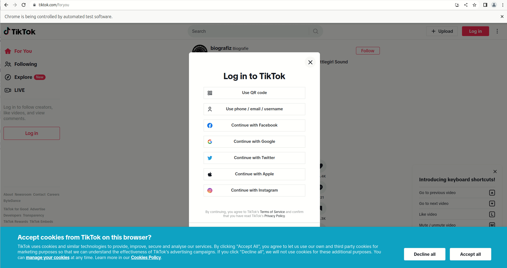

# Data Collection and Analysis of TikTok Hashtags with JavaScript and Phyton

import AuthorCard from "../../../src/components/AuthorCard.js";
import LevelChip from "../../../src/components/LevelChip.js";
import VideoCard from "../../../src/components/VideoCard.js";
import PlatformChip from "../../../src/components/PlatformChip.js";
import LanguageChip from "../../../src/components/LanguageChip.js";

<LevelChip level="Beginner to Advanced"></LevelChip>
<PlatformChip platform="TikTok"></PlatformChip>
<LanguageChip lang="JavaScript / Python"></LanguageChip>

<AuthorCard
  name="Martin Degeling"
  avatar="MD"
  position="Stiftung Neue Verantwortung"
  website="https://www.stiftung-nv.de/de/person/dr-martin-degeling"
  mastodon="https://chaos.social/@mrtn3000"
></AuthorCard>

<VideoCard
  videoSrc={require("@site/static/video/UPDEM_Degeling_540.mp4").default}
  thumbnailSrc={require("@site/static/video/UPDEM_Degeling_540.png").default}
></VideoCard>

In this chapter you will learn about the different steps necessary to conduct a hashtag analysis on TikTok that can result in a visualization like this: [Hashtag Analysis by Week](https://martin.degeling.com/snv/fyp-hashtags-by-week/)

The basis of the visualization is a continuous data collection of videos to TikTok.

Short **TikTok primer**: TikTok is an app-based social network where users share (mostly) short videos on various topics. Over the last few years TikTok has been the fastest growing social network worldwide Besides the focus on moving images another aspect that distinguishes TikTok from other social networks is that its feed algorithm (the recommender system) is less focused on the social graph (showing videos that your contacts have liked or viewed), but instead creates **interest graphs** that focus on showing content regardless of the author.

The purpose of a hashtags analysis on the TikTok front page, the For You Page(FYP), is to learn more about what kind of videos are initially shown to users that have not used the TikTok app before. The process of the analysis includes the **following steps**:

**Step 1:** Scraping Data with **puppeteer**

**Step 2:** Analyzing and Visualizing with **Jupyter Notebooks**

## Scraping Data on TikTok with puppeteer

For this analysis we will leverage the **web version of TikTok** accessible with any browser on TikTok.com.

While there are various “unofficial APIs” or libraries available that allow you to scrape content from TikTok, the purpose of this chapter is to build a scraper from scratch.

Below, you will find a basic scraping built on [pupeteer](https://github.com/puppeteer/puppeteer) to open the web version of the FYP.

### Tech Setup

To run this project, you should be able to open a command line on your computer and install software. For the first part you need to have [nodejs](https://nodejs.org/en) installed. After you have created a folder and navigated to it with the console run `npm install pupeteer` in it.

A **basic scraper** that opens the TikTok website should look like this:

```js
const puppeteer = require("puppeteer");

async function run() {
  // Setting up the browser
  const browser = await puppeteer.launch({
    executablePath: "/usr/bin/google-chrome", //we want to run chrome. You need to adjust this depening on your operating system
    headless: false, // we want to see what pupeteer is doing, headless:true would mean the browser is not shown
    defaultViewport: null,
    args: ["--window-size=1920,1080"],
  });
  const page = await browser.newPage(); // opening a new tab
  await page.goto("https://tiktok.com/foryou"); // open TikTok
}

run();
```

This should bring up a browser windows like this:


This basic process, already allows you to garner information about the videos TikTok would like to show you- even though you can’t see them. You can right-click on the page and select “view source” (or press ctrl+u) to see the HTML source code of the site. Search for “ItemModule” and you will be able to access information about the videos in a structured JSON-format.

The JSON object contains information about the first eight videos that are available or displayed on the FYP. The structure of each JSON object is shown [here](https://github.com/snv-berlin/tiktok-audit/blob/main/TikTok%20Web/examples/video_schema_web.json). You can extract that data automatically and put it on an internal list like this:

```js
// once the page is loaded we will search for the javascript block with the ID #SIGI_STATE and parse it's content as JSON
const sigistate = await page.$eval("#SIGI_STATE", (el) => el.innerHTML);
initinfo = JSON.parse(sigistate);
videos = [];

// Iterate through the list of videos and add it to our own data structure
Object.keys(initinfo.ItemModule).forEach(async (el, c) => {
  videos.push(initinfo.ItemModule[el]);
});
```

If you research requires you to get data on more videos, you have to interact with the website. When accessing the site, you will be initially prompted by a login popup, which you can close automatically.



If you are working with Chrome, you can use the developer settings to find out how you can manipulate the button with puppeteer. First open the developer console with F12, then right click the close icon, select “Inspect” and find the parent element that seems unique. In this case there is a `div` element with the attribute `data-e2e="modal-close-inner-button"`.
In puppeteer, you can use this attribute to identify the “X” and click it like this:

```js
let logindialog = await page.$('div[data-e2e="modal-close-inner-button"]'); // waiting until the page is loaded to the point where the dialog shows up
await logindialog.click(page, 'div[data-e2e="modal-close-inner-button"]'); // click on the X
```

After that we can scroll the page forever, tapping the key-down every two seconds.

```js
while (true) {
  // this loops runs indefinitivly, if we don't close it
  await page.waitForTimeout(2000); // wait 2000 milliseconds
  await page.keyboard.press("ArrowDown"); // pree the ArrowDown Key
}
```

When watching the bot scroll through TikTok and looking at the network traffic in the developer console you’ll notice that there is a infrequent call to a TikTok API `https://www.tiktok.com/api/recommend/item_list/ ` that returns a list of the next 30 videos. Finding this request and understanding what it is might be more complicated on other platforms or services. In some cases, [undocumented APIs](https://themarkup.org/levelup/2023/03/03/journalists-you-should-be-looking-for-undocumented-apis-heres-how-to-start) can be a key element of data-driven investigations to help make sense of what you are collecting.

With puppeteer, you can intercept network traffic and grab the list of recommended videos for your analysis - since it is running from within the browser you do not have to worry about any encryption. You can intercept the responses to this specific URL and process the video metadata as you like:

```js
await page.setRequestInterception(true); // setting up pupeteer to monitor requests and responses
page.on("request", (request) => request.continue()); // we do not care about requests send to servers, so we just continue on those
page.on("response", (response) => {
  // responses are parsed by the following script
  try {
    if (response.url().indexOf("api/recommend/item_list/item_list") > 0) {
      //if data comes from the API we have identified we process it
      response.json().then((data) => {
        // parse it as json
        data.itemList.forEach(async (el, c) => {
          // and iterate over the videos in the list to store.
          videos.push({ id: el.id, textExtra: el.textExtra });
        });
      });
      console.log("Received Video Data. Seen " + videos.length + " so far");
    }
  } catch (e) {
    console.log(e);
  }
});
```

**You have now successfully created a scraper for the TikTok public ForYouPage with less than 50 lines of code.** Review the full [here](https://github.com/snv-berlin/tiktok-hashtags-knowledgehub/blob/main/scraper/scrape_tiktok.js)

### Storing

To analyze a specific data set over a longer period, you need to store and process it. For this example project, you can use a file-based database like [node-json-db](https://www.npmjs.com/package/node-json-db) that stores everything in a single JSON file. If you plan to run a project like this on a larger scale, you should consider regular database servers like [Redis](https://redis.io/) or [MongoDB](https://mongodb.com/).
You can install it with `npm install node-json-db` similar to the installation of puppeteer above. You can than run the full code from [here](https://github.com/snv-berlin/tiktok-hashtags-knowledgehub/blob/main/scraper/scrape_tiktok_withDB.js)

Note that in this example you only store the video ID, hashtags and statistics as you do not need all the additional (personal) information and should ensure cleaning your scraped data for legal and ethical reasons.

## Analysis

### Tech Setup

To help analyze your data, consider using [jupyter](https://jupyter.org/) notebooks with python. Experience shows that [miniconda](https://docs.conda.io/en/latest/miniconda.html) works well to run python and install dependencies. You can use the conda environment published with this tutorial.

### Import Data

First, you can import the JSON database into a python dictionary:

```python
import json
with open('../../../tiktok-fyp-videos.json') as file:
    database = json.load(file)
print(len(database.keys()), 'videos in database')
```

This will result in something like: 474 videos in database (if you let the scraper run longer or multiple times, you will of course have more videos in your dataset).

At this point you can have a look at the data you have collected so far.

```python
import pprint
pprint.pprint(next(iter(database.values())))
```

This will print the first video in the database. You can find an example of the structure of the video object [here](https://github.com/snv-berlin/tiktok-hashtags-knowledgehub/blob/main/scraper/example_video_metadata.json). It contains a lot of technical information, e.g. about the video quality and URLs of cover pictures, avatars, music and subtitles.
But also the name of the author in `authorID` some statics in `stats` and of course the hashtags in the `textExtra` field.
Let's first look at the video statistics. We can iterate over all videos and collect the views in an array. And then let the numpy package do the math:

```python
video_views = []
for video in database.values():
    video_views.append(video["stats"]["playCount"])

average = np.mean(video_views)
print("Average views:", average)
```

This will result in `Average views: 20519932.70042194`, or in plainer terms: more than 20 million views per video on average. That seems like a lot. A histogram plot shows that the data is not evenly distributed. There are a few videos with a huge number of views. Outliers from the rest.


Because of this distribution the median will therefore give a better idea of the 'average'

```python
median = np.median(video_views)
print("Median views:", median)
```

You can also limit the histogram plot to up to 10 million views and see that the majority of videos shown on the FYP for non-logged in web users is focused on videos that already had a large audience.


### Hashtag Analysis

You can now iterate over all videos in the database to count hashtag occurrences and videos without hashtags to better understand the quality of the data.

```python
from itertools import combinations
import numpy as np

videos_wo_hashtags = 0
hashtag_occurences = {}

for video in database.values():
    video_views.append(video["stats"]["playCount"])
    if "textExtra" in video:
        for hashtag in video["textExtra"]:
            if hashtag["hashtagName"] not in hashtag_occurences:
                hashtag_occurences[hashtag["hashtagName"]] = 1
            else:
                hashtag_occurences[hashtag["hashtagName"]] += 1
    else:
        videos_wo_hashtags += 1
# Use of hashtags
print("There are", videos_wo_hashtags, "videos without hashtags (", videos_wo_hashtags*100/len(database.keys()), "%)")
```

You will find that 17% of the videos do not use hashtags.

If you go ahead and plot the network of hashtag combinations, you will get a graph like this:


Similarly, you can also look at the distribution of hashtags by sorting the list and printing the 20 most common hashtags.

```python
hashtags_sorted = dict(sorted(hashtag_occurences.items(), key=lambda item: item[1], reverse=True))
print("The ten most common hashtags:")
print(list(hashtags_sorted)[:20])
```

You see that the most common hashtags are related to TikTok itself and do not describe its content. To learn more about what type of videos are shown on the FYP you should exclude these hashtags:
['fyp', '', 'viral', 'foryou', 'foryoupage', 'fy', 'fyp シ', 'funny', 'funnyvideos', 'tiktok', 'fürdich', 'trending', 'trend', 'viralvideo']

A network graph consists of nodes (the circles) and edges (connections). Again you iterate over all videos to get a list of hashtags (nodes) and store as an edge if they occurred together on a video.

```python
exclude_hashtags = ['fyp', '', 'foryou', 'viral', 'foryoupage', 'fypシ', 'fy', 'fürdich', 'trending', 'foryoupage', 'tiktok', 'viralvideo', 'fürdichseiteシ', '4u']
hashtag_nodes = {}
hashtag_edges = []
for video in database.values():
	listofhashtags = []
	if "textExtra" in video:
		for hashtag in video["textExtra"]:
			if hashtag["hashtagName"] not in exclude_hashtags:
				listofhashtags.append(hashtag["hashtagName"])
				if hashtag["hashtagName"] not in hashtag_nodes:
					hashtag_nodes[hashtag["hashtagName"]]=len(hashtag_nodes.keys())+1
	for combination in combinations(listofhashtags, 2):
		hashtag_edges.append([hashtag_nodes[combination[0]],
		hashtag_nodes[combination[1]]])

```

and visualize it with pyvis:

```python
net = pyvis.network.Network(notebook=False, cdn_resources='local')

node_count = 1
for hashtag in hashtag_nodes:
	net.add_node(node_count, label=hashtag)
	node_count+=1
	net.add_edges(hashtag_edges)
	net.show_buttons(filter_='physics')
net.show('selected_hashtags.html')
```


## What to do with the results

Congratulations you've set up a TikTok scraper that collects data on videos shown on the FYP page and visualized them in a network. You can now start to dive deep into the data and identify topic clusters or learn what topics are dominating the network.
