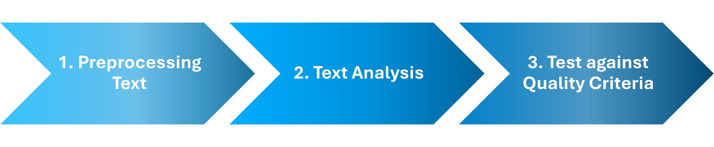
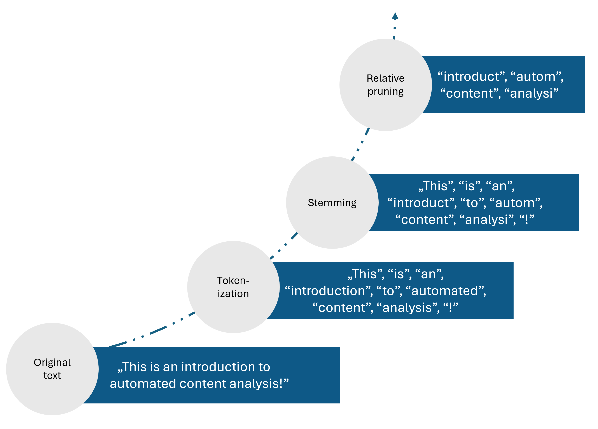
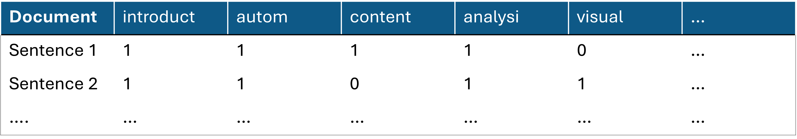
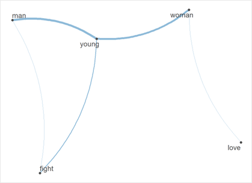

# Overview: How to analyse social media data

<AuthorCard
  name="Valerie Hase"
  avatar="VH"
  avatarSrc={require("@site/static/img/contributors/hase.png").default}
  position="Postdoctoral Scholar, LMU Munich"
  website="https://valerie-hase.com"
  linkedin="https://ch.linkedin.com/in/valerie-hase-a9760564"
/>

<LastUpdatedByChip authorOriginal="Valerie Hase" createdOn="04.12.2024" />

## Introduction to text-as-data methods

Social media data offer the possibility to study, for example, citizens’ behaviour online or the content they are exposed to on digital platforms. The large quantity of such data, however, can necessitate the use of automated methods. In addition to [existing overviews on data collection methods](https://data-knowledge-hub.com/docs/data-collection/03_02_data-collection-methods) and analysis methods like [network analysis](https://data-knowledge-hub.com/docs/data-analysis/04_00_code-samples/social-network-analysis), this chapter introduces text-as-data methods.

**Text-as-data methods are approaches where text analysis is, to some extent, automatised through programming scripts** (Hase, [2023](https://link.springer.com/chapter/10.1007/978-3-658-36179-2_3)) – though this still requires human input, for example, to inspect and validate results. The method is called “text-as-data” or “automated content analysis”, as text is broken down to and analysed in a numeric format (e.g., word counts as “features”). Typically, text-as-data methods include three key steps: (1) **preprocessing text** (i.e., preparing text for analysis), (2) **text analysis** (conducting the analysis), and (3) **test against quality criteria** (i.e., checking the quality of results).

*Key steps of text-as-data methods*

## Preprocessing

Preprocessing describes the **cleaning and normalisation** of text for analysis. On the one hand, social media posts may include irrelevant context (e.g., boilerplate content such as URLs if retrieved via scraping), which researchers need to remove when cleaning the data in preparation for their analysis. On the other hand, social media content often contains “unstructured” text, where users employ different spelling or punctuation. That means, that researchers have to normalise data, for example by harmonising different spelling of similar features. While relevant preprocessing steps vary across methods and data sets, these often include:

-   Removal of boilerplate content (e.g., excluding formatting)

-   Tokenisation (breaking texts down into its individual features, like words)

-   Lower casing (removing capitalisation)

-   Removing symbols, punctuation, or numbers

-   Reducing features to word stems/base forms (e.g., via “stemming” or “lemmatisation”)

-   Relative pruning (removing frequent/rare words, such as “stop words”)

Take, for example, the sentence “*This is an introduction to automated content analysis!*”. If we run a selection of preprocessing steps on this sentence (e.g., tokenisation, stemming, relative pruning), it is reduced to the count of what we assume to be its most relevant features: “introduct”, “autom”, “content”, “analysi” (see related preprocessing tutorials in [R](https://colab.research.google.com/github/valeriehase/Salamanca-CSS-SummerSchool/blob/main/Processing%20text%20and%20text%20as%20data/3_R_Code_Processing_text_and_text_as_data.ipynb) and [Python](https://colab.research.google.com/github/valeriehase/Salamanca-CSS-SummerSchool/blob/main/Processing%20text%20and%20text%20as%20data/4_Python_Code_Processing_text_and_text_as_data.ipynb)).

*Example of preprocessing pipeline*

To turn this into a numeric representation, researchers transform texts into a **document-feature-matrix** (**DFM**). Here, rows identify the unit of analysis (e.g., sentences), columns identify features (e.g., “introduct”, “autom”), and cell values identify the frequency of features in each sentence. To illustrate, let’s compare the numeric representation of “*This is an introduction to automated content analysis!*” (Sentence 1) and “*This is an introduction to automated visual analysis”* (Sentence 2) in a DFM: We can see that these share features, such as “introduct”, “autom”, but also differ concerning others, namely “content” vs. “visual”. DFM-representations rely on the **“bag-of-words” assumption**, meaning that features are interpreted independently of their order in texts or their context.

*Numeric representation: Document-feature-matrix*

## Analysis

Next, researchers must choose a text-as-data approach to analyse preprocessed texts. Here, I will discuss five popular methods: (1) dictionaries, (2) semantic network analysis, (3) supervised machine learning, (4) topic modelling, and (5) large language models.

| Method                           | Description                                                                                 | Tutorials                                                                                                                                                                                                                 |
|----------------------------------|---------------------------------------------------------------------------------------------|---------------------------------------------------------------------------------------------------------------------------------------------------------------------------------------------------------------------------|
| **Dictionary**                   | Lists of relevant features to identify things like sentiments                               |  [Tutorial R](https://bookdown.org/valerie_hase/TextasData_HS2021/tutorial-12-rule-based-approaches-dictionaries.html)    [Tutorial Python](https://cssbook.net/content/chapter11.html#sec-dictionary) |
| **Semantic Network Analysis**    | Network analysis to analyse and visualise the co-occurrence of features                     |  [Tutorial R](https://ladal.edu.au/net.html)     [Tutorial Python](https://cssbook.net/content/chapter13.html)                                          |
| **Supervised Machine Learning**  | Training of algorithms on manually annotated texts to classify known variables in new texts |  [Tutorial R](https://content-analysis-with-r.com/5-machine_learning.html)    [Tutorial Python](https://cssbook.net/content/chapter11.html#sec-supervised)                           |
| **Topic Modelling**              | Using feature co-occurrences to identify previously unknown topics in texts                 |  [Tutorial R](https://tinyurl.com/56mt46rd)    [Tutorial Python](https://tinyurl.com/8cnfk2m3)                                                        |
| **Large Language Models (LLMs)** | Using prompts to identify known variables in new texts using little or no training data     |  [Tutorial R](https://www.youtube.com/watch?v=N-k3RZqiSZY)    [Tutorial Python](https://github.com/mlabonne/llm-course)                                              |

### Dictionaries

Dictionaries describe lists of features that researchers presume describe latent concepts. Using dictionaries, researchers count the occurrence of these features to identify more abstract concepts. A widely known example is sentiment analysis, where negative or positive features – in their simplest form: words like “bad” or “good” – are used to identify positive or negative sentiment. Researchers can rely on off-the-shelf dictionaries (i.e., existing lists of features often developed in other contexts) or organic dictionaries (i.e., news lists of features they develop for their specific context and data). However, especially off-the-shelf dictionaries often fail to capture more complex aspects of language, such as irony or negation (Boukes et al., [2020](https://www.tandfonline.com/doi/full/10.1080/19312458.2019.1671966)), indicating that organic dictionaries or other text-as-data approaches may often be the more suitable choice.

### Semantic network analysis

Semantic network analysis, a particular case of network analysis, describes and visualises the co-occurrence of features, meaning how often different words occur in the same text. In such networks, nodes (data points) describe features, while edges (connections between them) describe the frequency of their co-occurrence. Take the example below, which illustrates how often men vs. women are described with specific features in an example corpus: Both are similarly often described as “young”. However, women are more often characterised with words like “love” and men with words like “fight,” which may indicate gender stereotypes.

*Understanding gender stereotypes via semantic network analysis*

### Supervised Machine Learning

Supervised machine learning describes an approach where algorithms learn how to classify texts based on their training of manually annotated training data. Usually, human coders annotate previously defined variables, such as, whether a text is positive or negative. Through training on this data, algorithms learn which features predict positive vs. negative sentiment. The same classifier is then used to apply this knowledge and classify new corpora. Here, researchers can choose from various algorithms (e.g., [Naïve Bayes](https://www.geeksforgeeks.org/naive-bayes-classifiers/), [Random Forest](https://www.geeksforgeeks.org/building-a-randomforest-with-caret)) or combine these as ensembles. As classifiers can take into account many different features in training data, they often perform better than dictionaries, which are more restricted in the number of features they consider (Barberá et al., [2021](https://www.cambridge.org/core/journals/political-analysis/article/automated-text-classification-of-news-articles-a-practical-guide/10462DB284B1CD80C0FAE796AD786BC6)).

### Topic modelling

Topic modelling describes an exploratory approach where algorithms use the co-occurrences of features in texts to identify previously unknown topics. In short, the approach understands texts as a mixture of topics (e.g., “politics” vs. “economy” vs. “sports”) characterised by distributions over words (e.g., “politics” as being described by features like “politician”, “election”, and “government”). Distributions of topics in texts and distributions of features in topics are learned exploratively from the specific corpus and not defined beforehand. To run a topic model, researchers have to define how many topics they want to identify and interpret what these mean – indicating large degrees of freedom in setting up such analyses (Maier et al., [2018](https://doi.org/10.1080/19312458.2018.1430754)).

### Large Language Models

Large Language Models (LLMs) have become increasingly important in recent years. These approaches go beyond the “bag-of-words” approach in that they can assign features context-dependent meanings. For example, the word “bank” may take on a different meaning in the sentence “*He went to the outer bank of the river*” compared to “*He got a loan from the bank*”, something LLMs can account for. LLMs are trained on vast amounts of text using the transformer architecture, where text is used as training data as a form of self-supervised learning to understand which features likely predict the next (Wankmüller, [2024](https://doi.org/10.1177/00491241221134527)). This pre-trained knowledge has enabled the rise of LLMs, which rely on few- or zero-shot learning: Researchers can use little or no training data to annotate text based on short instructions, so-called prompts (Törnberg, [2024](https://journals.sagepub.com/doi/10.1177/08944393241286471#tab-contributors)). In turn, researchers have to write effective prompts to train LLMs, known as prompt-tuning, and can adapt LLM parameters to specific tasks or data, referred to asfine-tuning (for an overview of R and Python packages, see Demszky et al., [2023](https://doi.org/10.1038/s44159-023-00241-5)).

## Test against quality criteria

Finally, researchers need to test the quality of their results. This includes the **reproducibility** of results (i.e., whether re-running code leads to the same results) or the **reliability** of methods (i.e., whether different methodological parameters lead to comparable results). Most importantly, researchers need to guarantee the **validity** of their results. Here, they often compare the result of their automated analysis to a manual annotation of the same text. The evaluation of validation is done based on metrics such as **precision** (i.e., how good is the text-as-data method at not identifying too many irrelevant texts) and **recall** (i.e., how good is the text-as-data method at identifying all relevant texts?; for a tutorial, see [here](https://bookdown.org/valerie_hase/TextasData_HS2021/tutorial-14-validating-automated-content-analyses.html)).

## References

**Barberá**, P., Boydstun, A. E., Linn, S., McMahon, R., & Nagler, J. (2021). Automated Text Classification of News Articles: A Practical Guide. *Political Analysis*, *29*(1), 19–42. https://doi.org/10.1017/pan.2020.8

**Boukes**, M., van de Velde, B., Araujo, T., & Vliegenthart, R. (2020). What’s the Tone? Easy Doesn’t Do It: Analyzing Performance and Agreement Between Off-the-Shelf Sentiment Analysis Tools. *Communication Methods and Measures*, *14*(2), 83–104. https://doi.org/10.1080/19312458.2019.1671966

**Demszky**, D., Yang, D., Yeager, D. S., Bryan, C. J., Clapper, M., Chandhok, S., Eichstaedt, J. C., Hecht, C., Jamieson, J., Johnson, M., Jones, M., Krettek-Cobb, D., Lai, L., JonesMitchell, N., Ong, D. C., Dweck, C. S., Gross, J. J., & Pennebaker, J. W. (2023). Using large language models in psychology. *Nature Reviews Psychology*. https://doi.org/10.1038/s44159-023-00241-5

**Hase**, V. (2023). Automated Content Analysis. In F. Oehmer, S. H. Kessler, E. Humprecht, K. Sommer, & L. Castro Herrero (eds.), *Handbook of Standardized Content Analysis: Applied Designs to Research Fields of Communication Science*. VS Springer (pp. 23–36). https://doi.org/10.1007/978-3-658-36179-2_3

**Maier**, D., Waldherr, A., Miltner, P., Wiedemann, G., Niekler, A., Keinert, A., Pfetsch, B., Heyer, G., Reber, U., Häussler, T., Schmid-Petri, H., & Adam, S. (2018). Applying LDA Topic Modeling in Communication Research: Toward a Valid and Reliable Methodology. *Communication Methods and Measures*, *12*(2–3), 93–118. https://doi.org/10.1080/19312458.2018.1430754

**Törnberg**, P. (2024). Large Language Models Outperform Expert Coders and Supervised Classifiers at Annotating Political Social Media Messages. *Social Science Computer Review*, 08944393241286471. https://doi.org/10.1177/08944393241286471

**Wankmüller**, S. (2024). Introduction to Neural Transfer Learning With Transformers for Social Science Text Analysis. *Sociological Methods & Research*, *53*(4), 1676–1752. https://doi.org/10.1177/00491241221134527
