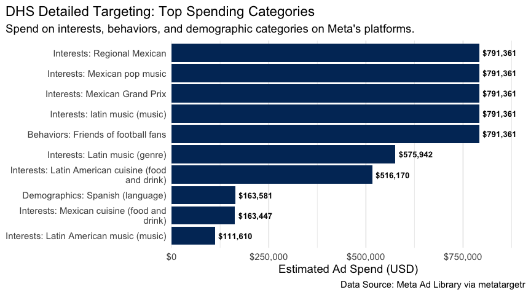
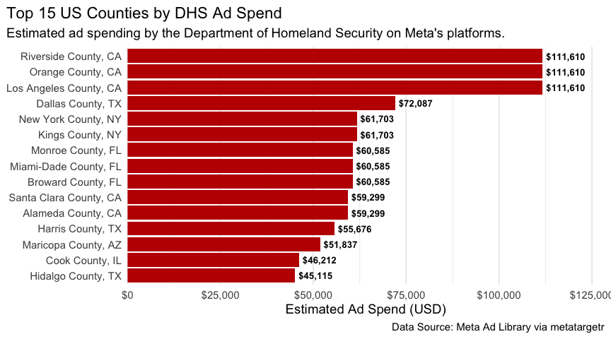
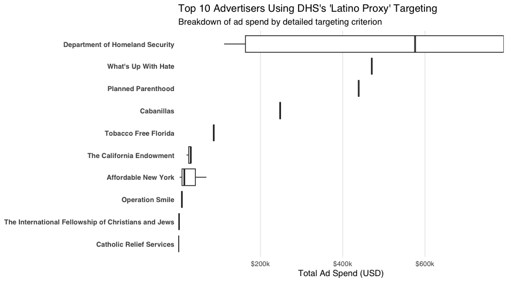

<LevelChip level="Intermediate" />
<PlatformChip platform="Meta"/>
<LanguageChip lang="R"/>


<AuthorCard
  name="Fabio Votta"
  avatar="FV"
  avatarSrc={require("@site/static/img/contributors/votta.jpg").default}
  position="ASCoR | University of Amsterdam"
  website="https://www.favstats.eu/"
  bluesky="https://bsky.app/profile/favstats.eu"
  linkedin="https://www.linkedin.com/in/dr-fabio-votta-81a862131"
/>

<LastUpdatedByChip authorOriginal="Fabio Votta" createdOn="30.07.2025" />


## Introduction

What political messages are being sent to which audiences? By using
digital advertising tools provided by social media platforms,
advertisers can select which audiences they want to reach and are able
to send different messages for each one of them. That is why
understanding the use of target audiences is as crucial as knowing what
is being advertised. While Meta’s official Ad Library API provides a
range of data, its restrictive access requirements and limited targeting
granularity often fall short of the needs of researchers and
journalists. The `metatargetr` R package offers an alternative,
unofficial route to this information, by retrieving and archiving ad
data directly from Meta’s public-facing Ad Library.

This tutorial focuses on how to use `metatargetr` to retrieve and, most
importantly, analyze this targeting data. Unlike the official Meta Ad
Library API, which provides data on an ad-by-ad basis with broad
spending ranges, `metatargetr` offers a unique, advertiser-level
perspective.

Here are the key advantages over Meta’s official Ad Library API:

- **Advertiser-Level Data:** Instead of looking at single ads, we get a
  consolidated view of the entire targeting strategy of a Facebook page
  or Instagram account.

- **Exact Spending per Criterion:** The data provides the exact percentage
  of a page’s total spend allocated to each specific targeting
  criterion. This allows for precise analysis of budget allocation, a
  feature not available through the official API.

- **Additional Audience Insights:** The dataset goes beyond the demographic
  targeting that is available via the API, as it reveals spending on
  powerful tools like Detailed Targeting (e.g. interest profiles that
  Meta categorizes its users in), Custom Audiences (e.g., targeting a
  list of existing customers) and Lookalike Audiences (targeting users
  similar to an existing audience). Furthermore, while only demographic
  targeting (age, gender, location) is available for countries in the EU
  since the implementation of the Digital Services Act (DSA),
  `metatargetr` provides targeting insights for all advertising pages on
  Meta in the world.

This tutorial will walk you through installing the package, retrieving
historical targeting data, and using tidyverse tools to create
compelling visualizations that reveal these hidden strategies.

Finally, it is important to note that `metatargetr` relies on web
scraping. This means it can be susceptible to changes in Facebook’s
website structure. While powerful, it should be considered a
complementary tool to the official API. [For a guide on using the
official Meta Ad Library API](https://data-knowledge-hub.com/docs/data-collection/03_00_platform-specific%20guidelines/03_04_data-collection_meta_ads), please see the other tutorial in this series.

### Installation

First, you will need to install `metatargetr` and a few other helpful
packages from the tidyverse ecosystem. Since `metatargetr` is hosted on
GitHub, we will use the pak package for a smooth installation process.

``` r
# Install pak if you don't have it already
if (!require("pak")) install.packages("pak")


# Install `metatargetr` and other useful packages
pak::pak(c(
  "favstats/metatargetr",
  "tidyverse",
  "lubridate",
  "scales"
))
```

Now loading in the R packages:

``` r
library(metatargetr)
library(tidyverse)
library(lubridate)
library(scales)
```

### Retrieving Targeting Information for Recent Ads (`get_targeting`)

The core function for fetching live targeting data is `get_targeting()`.
This function scrapes the “Audience” tab of a Page’s Ad Library section,
providing insights into the age, gender, location but also custom and
lookalike audience targeting of their *recent ads* (i.e. only for the
last 7, 30, and 90 days).

Let us retrieve the targeting data for a specific Facebook Page. You
will need the Page ID, which can be found in the URL of the page’s Ad
Library entry or in the [Meta Ad Library
Report](https://www.facebook.com/ads/library/report/) (which you can
also query via `metatargetr` using `get_ad_report`).

For example, here is the URL of the Ad Library page of the U.S.
Department of Homeland Security (DHS):

> https://www.facebook.com/ads/library/?view_all_page_id=179587888720522

The Page ID is the number after `view_all_page_id=` → **`179587888720522`**.

Here are the most important function parameters:

- `id`: A character string representing the (Facebook) Page ID.

- `timeframe`: The time period for the data. Options are “LAST_7_DAYS”,
  “LAST_30_DAYS”, or “LAST_90_DAYS”. The default is set at
  “LAST_30_DAYS”.

Let us retrieve the targeting info from a page that is currently
conducting large digital ad campaign, the U.S. Department of Homeland
Security:

``` r
# Fetch targeting data for a specific page for the last 30 days
dhs_targeting_data <- get_targeting(id = "179587888720522", timeframe = "LAST_30_DAYS")

# Inspect the structure of the returned data
glimpse(dhs_targeting_data)
```
``` 
    ## Rows: 91
    ## Columns: 15
    ## $ value                 <chr> "All", "Women", "Men", "Spanish", "Boston (Manch…
    ## $ num_ads               <int> 15, 0, 0, 15, 1, 1, 1, 1, 1, 1, 1, 1, 1, 1, 1, 1…
    ## $ total_spend_pct       <dbl> 1.00000000, 0.00000000, 0.00000000, 1.00000000, …
    ## $ type                  <chr> "gender", "gender", "gender", "language", "locat…
    ## $ location_type         <chr> NA, NA, NA, NA, "geo_markets", "COUNTY", "BOROUG…
    ## $ num_obfuscated        <int> NA, NA, NA, NA, 0, 0, 0, 0, 0, 0, 1, 0, 0, 0, 0,…
    ## $ is_exclusion          <lgl> NA, NA, NA, NA, FALSE, FALSE, FALSE, FALSE, FALS…
    ## $ detailed_type         <chr> NA, NA, NA, NA, NA, NA, NA, NA, NA, NA, NA, NA, …
    ## $ ds                    <chr> "2025-07-24", "2025-07-24", "2025-07-24", "2025-…
    ## $ main_currency         <chr> "USD", "USD", "USD", "USD", "USD", "USD", "USD",…
    ## $ total_num_ads         <int> 15, 15, 15, 15, 15, 15, 15, 15, 15, 15, 15, 15, …
    ## $ total_spend_formatted <chr> "$347,094", "$347,094", "$347,094", "$347,094", …
    ## $ is_30_day_available   <lgl> TRUE, TRUE, TRUE, TRUE, TRUE, TRUE, TRUE, TRUE, …
    ## $ is_90_day_available   <lgl> TRUE, TRUE, TRUE, TRUE, TRUE, TRUE, TRUE, TRUE, …
    ## $ page_id               <chr> "179587888720522", "179587888720522", "179587888…
``` 

The output will be a tibble where each row represents a specific
demographic or location targeting segment for the ads run by that page
in the specified timeframe. Key columns include:

- `value`: The exact targeting criterion used.

- `type`: The category of targeting (e.g., “age”, “gender”, “location”,
  etc.).

- `total_spend_pct`: The proportion of the page’s ad spend directed at
  a target audience (`value`) within the timeframe specified.

- `total_spend_formatted`: The total ad spend of the page in the
  timeframe specified.

- `main_currency`: Information about the currency used by the page.

### Historical Targeting Data at Scale (`get_targeting_db`)

The `get_targeting()` function is enough for retrieving targeting info
for specific pages that have run ads up to the last 90 days. However,
once 90 days have passed, Meta *does not* provide access to this data
anymore. This is where `metatargetr`’s true power lies: it retrieves,
archives, and provides access to a vast repository of pre-collected
targeting data for *all pages running political advertisements in the
world*. This data can be accessed through the `get_targeting_db()`
function, which downloads historical datasets have been collected since
late 2023.

Here are the most important function parameters:

- `the_cntry`: The two-letter ISO country code for the desired dataset
  (e.g., “DE”, “US”).

- `tf`: The timeframe in days (“LAST_7_DAYS”, “LAST_30_DAYS”,
  “LAST_90_DAYS”).

- `ds`: A date string in “YYYY-MM-DD” format, identifying the date of
  the specific archived dataset.

A tip before you download a historical dataset: the
`get_targeting_metadata()` function allows you to see the available
dates for a given country and timeframe as the automated retrieval
process established by the package may have missed a certain date for a
specific country (or because Meta skipped them).

``` r
# Get metadata for 90-day timeframe datasets in the US
us_90_day_metadata <- get_targeting_metadata(country_code = "US", timeframe = "90")

# View the most recent available dates
head(us_90_day_metadata)
```
``` 
    ## # A tibble: 6 × 3
    ##   cntry ds         tframe      
    ##   <chr> <chr>      <chr>       
    ## 1 US    2025-07-24 last_90_days
    ## 2 US    2025-07-23 last_90_days
    ## 3 US    2025-07-22 last_90_days
    ## 4 US    2025-07-21 last_90_days
    ## 5 US    2025-07-20 last_90_days
    ## 6 US    2025-07-18 last_90_days
``` 

Once you have identified a dataset you want, you can download it with
`get_targeting_db()`. Note that the archived data is typically available
with a delay of a few days. This function allows for powerful
longitudinal analysis across thousands of advertisers.

``` r
# Download the US 90-day targeting dataset from a specific date in the past
us_targeting_archive <- get_targeting_db(the_cntry = "US", tf = "90", ds = "2025-06-30")

# Inspect the archived data
# It contains the same structure as the live data, but for thousands of pages
glimpse(us_targeting_archive)
```
``` 
    ## Rows: 690,219
    ## Columns: 37
    ## $ internal_id              <chr> NA, NA, NA, NA, NA, NA, NA, NA, NA, NA, NA, N…
    ## $ no_data                  <lgl> NA, NA, NA, NA, NA, NA, NA, NA, NA, NA, NA, N…
    ## $ tstamp                   <dttm> 2025-07-04 05:30:28, 2025-07-04 05:30:28, 20…
    ## $ page_id                  <chr> "761832453834971", "761832453834971", "761832…
    ## $ cntry                    <chr> "US", "US", "US", "US", "US", "US", "US", "US…
    ## $ page_name                <chr> "League of Independent Voters of Texas", "Lea…
    ## $ partyfacts_id            <chr> NA, NA, NA, NA, NA, NA, NA, NA, NA, NA, NA, N…
    ## $ sources                  <chr> NA, NA, NA, NA, NA, NA, NA, NA, NA, NA, NA, N…
    ## $ country                  <chr> NA, NA, NA, NA, NA, NA, NA, NA, NA, NA, NA, N…
    ## $ party                    <chr> NA, NA, NA, NA, NA, NA, NA, NA, NA, NA, NA, N…
    ## $ left_right               <dbl> NA, NA, NA, NA, NA, NA, NA, NA, NA, NA, NA, N…
    ## $ tags                     <glue> NA, NA, NA, NA, NA, NA, NA, NA, NA, NA, NA, …
    ## $ tags_ideology            <chr> NA, NA, NA, NA, NA, NA, NA, NA, NA, NA, NA, N…
    ## $ disclaimer               <chr> "LEAGUE OF INDEPENDENT VOTERS OF TEXAS", "LEA…
    ## $ amount_spent_usd         <chr> "405", "405", "405", "405", "405", "405", "40…
    ## $ number_of_ads_in_library <chr> "14", "14", "14", "14", "14", "14", "14", "14…
    ## $ date                     <chr> "2025-06-29", "2025-06-29", "2025-06-29", "20…
    ## $ path                     <chr> "extracted/FacebookAdLibraryReport_2025-06-29…
    ## $ tf                       <chr> "last_90_days", "last_90_days", "last_90_days…
    ## $ remove_em                <lgl> FALSE, FALSE, FALSE, FALSE, FALSE, FALSE, FAL…
    ## $ total_n                  <int> 35543, 35543, 35543, 35543, 35543, 35543, 355…
    ## $ amount_spent             <dbl> 405, 405, 405, 405, 405, 405, 405, 405, 405, …
    ## $ value                    <chr> "All", "Women", "Men", "Bastrop, TX, United S…
    ## $ num_ads                  <int> 14, 0, 0, 7, 1, 6, 1, 0, 0, 0, 0, 0, 14, 14, …
    ## $ total_spend_pct          <dbl> 1.00000000, 0.00000000, 0.00000000, 0.6351905…
    ## $ type                     <chr> "gender", "gender", "gender", "location", "lo…
    ## $ location_type            <chr> NA, NA, NA, "CITY", "CITY", "countries", "zip…
    ## $ num_obfuscated           <int> NA, NA, NA, 2, 1, 0, 0, NA, NA, NA, NA, NA, N…
    ## $ is_exclusion             <lgl> NA, NA, NA, FALSE, FALSE, FALSE, FALSE, NA, N…
    ## $ custom_audience_type     <chr> NA, NA, NA, NA, NA, NA, NA, NA, NA, NA, NA, N…
    ## $ ds                       <chr> "2025-06-30", "2025-06-30", "2025-06-30", "20…
    ## $ main_currency            <chr> "USD", "USD", "USD", "USD", "USD", "USD", "US…
    ## $ total_num_ads            <int> 14, 14, 14, 14, 14, 14, 14, 14, 14, 14, 14, 1…
    ## $ total_spend_formatted    <dbl> 405, 405, 405, 405, 405, 405, 405, 405, 405, …
    ## $ is_30_day_available      <lgl> TRUE, TRUE, TRUE, TRUE, TRUE, TRUE, TRUE, TRU…
    ## $ is_90_day_available      <lgl> TRUE, TRUE, TRUE, TRUE, TRUE, TRUE, TRUE, TRU…
    ## $ detailed_type            <chr> NA, NA, NA, NA, NA, NA, NA, NA, NA, NA, NA, N…
``` 

## Analyzing DHS Ad Campaigns 🏛️

Now, let us apply what we have learned in a practical case study. We
will analyze the ad campaigns of the U.S. Department of Homeland
Security (DHS) to showcase how to combine historical data and visualize
targeting strategies. In this case study we analyze audience segments
derived from detailed targeting, how spend is allocated across those
segments, the county-level geographic focus of the campaign, and which
other advertisers use DHS-style proxy targeting. If you are interested
in a similar analysis I have conducted for a recent blog post of mine,
you can read the full post [here](https://www.favstats.eu/post/dhs/).


Figure shows the ads that DHS runs which has DHS secretary Kristi Noem threaten "if you are here illegally we will find and you and deport you" with Spanish subtitles.

First, we will use `get_targeting_db()` to download two historical
snapshots of U.S. ad data. By combining data from different time points,
we can create a more comprehensive picture of an advertiser’s strategy
over a longer period.


### Retrieving and Combining Data

``` r
# Download two datasets from different dates
targeting_jun <- get_targeting_db(the_cntry = "US", tf = "90", ds = "2025-06-30")
targeting_apr <- get_targeting_db(the_cntry = "US", tf = "90", ds = "2025-04-01")

# Combine the datasets and filter for the DHS page
# The DHS Facebook Page ID is "179587888720522"
dhs_data_raw <- targeting_jun %>% 
  bind_rows(targeting_apr) %>% 
  filter(page_id == "179587888720522")
```


The raw data contains spending percentages relative to the total spend
at the time of each snapshot. To get an accurate picture of the total
spend over our *combined period*, we need to aggregate the data
correctly. The helper function `aggr_targeting` recalculates the
spending for each targeting criterion based on the new, combined total.

``` r
# Apply the function to our DHS data
dhs_data_agg <- aggr_targeting(dhs_data_raw)
```
:::hub-note Note
The `aggr_targeting()` function creates a variable called `spend_per` which shows the spend per targeting criterion across the combined period. If you pull raw data with `get_targeting_db()`, you have to compute this measure yourself as *total spending* (`total_spend_formatted`) *×* *share of spending* (`total_spend_pct`).
:::


### Visualizing "Detailed" Targeting Criteria

One of the most powerful features of this dataset is the ability to see
the specific interests and behaviors an advertiser targets – data that
is not available via the typical API. Let us visualize what portion of
the DHS budget was spent on these “detailed” targeting criteria.


``` r
# Filter for "detailed" targeting types and plot the top categories
dhs_data_agg %>%
  filter(type == "detailed") %>%
  # For better labels, combine the type and value
  mutate(
    display_value = str_wrap(paste0(str_to_title(detailed_type), ": ", value), width = 40)
  ) %>%
  # Keep the top 10 criteria by spend
  slice_max(order_by = spend_per, n = 10) %>%
  # Create the plot
  ggplot(aes(x = spend_per, y = fct_reorder(display_value, spend_per))) +
  geom_col(fill = "#003366") +
  geom_text(
    aes(label = dollar(spend_per, accuracy = 1)),
    hjust = -0.1,
    size = 3.5,
    fontface = "bold"
  ) +
  scale_x_continuous(
    labels = label_dollar(),
    expand = expansion(mult = c(0, 0.15))
  ) +
  labs(
    title = "DHS Detailed Targeting: Top Spending Categories",
    subtitle = "Spend on interests, behaviors, and demographic categories on Meta's platforms.",
    x = "Estimated Ad Spend (USD)",
    y = NULL,
    caption = "Data Source: Meta Ad Library via metatargetr"
  ) +
  theme_minimal(base_size = 14) +
  theme(
    panel.grid.major.y = element_blank(),
    plot.title.position = "plot"
    )
```




This chart clearly shows the specific audience segments the DHS
prioritized. We can see a significant focus on users who are interested
in Mexican culture events and music, and whose language is set to
Spanish. This provides concrete, data-driven insights into their
campaign strategy that would be difficult to obtain otherwise.

:::hub-note Note
When multiple targeting criteria show identical spend, that likely indicates they were applied together on the same underlying ads. Because the data that is retrieved is aggregated at the advertiser level it is hard to isolate ads that ran simultaneously. For a better measurement of spend we could divide the total spending by the number of targeting criteria that have the same data (same number of ads and spending) by assuming that spending was divided about equally to each targeting criterion.
:::

### Visualizing Location Targeting Criteria

Next, let us analyze where the money was spent. We can filter the data
for location targeting and visualize the top-spending counties. This
reveals the geographic focus of the campaigns.

``` r
# Filter for county-level location targeting and plot the top 15
dhs_data_agg %>%
  filter(location_type == "COUNTY") %>%
  slice_max(order_by = spend_per, n = 15) %>%
  mutate(
    location_label = str_remove(value, ", United States")
  ) %>%
  ggplot(aes(x = spend_per, y = fct_reorder(location_label, spend_per))) +
  geom_col(fill = "#c00000") +
  geom_text(
    aes(label = dollar(spend_per, accuracy = 1)),
    hjust = -0.1,
    size = 3.5,
    fontface = "bold"
  ) +
  scale_x_continuous(
    labels = label_dollar(),
    expand = expansion(mult = c(0, 0.15))
  ) +
  labs(
    title = "Top 15 US Counties by DHS Ad Spend",
    subtitle = "Estimated ad spending by the Department of Homeland Security on Meta's platforms.",
    x = "Estimated Ad Spend (USD)",
    y = NULL,
    caption = "Data Source: Meta Ad Library via metatargetr"
  ) +
  theme_minimal(base_size = 14) +
  theme(
    panel.grid.major.y = element_blank(),
    plot.title.position = "plot"
  )
```



This visualization instantly reveals the geographic focus of the DHS’s
advertising efforts. The spending is heavily concentrated in major
metropolitan area, particularly in states like California, Texas, New
York, and Florida with a large share of Latino citizen. This kind of
analysis is invaluable for understanding the geographic scope and
strategy of public information campaigns.

### Visualizing Top 10 Spenders using Ethnic Proxies


> Who else is using targeting these targeting criteria that DHS utilizes
> as proxies to reach the Latino community?

First, the detailed targeting criteria used by the DHS ads are filtered,
and *all* of the data is aggregated.

``` r
latino_targeting <- dhs_data_agg %>% 
  filter(type == "detailed") %>% 
  select(value, type) %>% 
  ## lets remove friends of football fans as that is not related by itself
  filter(value != "Friends of football fans")

us_aggr <- targeting_jun %>% 
  bind_rows(targeting_apr) %>% 
  inner_join(latino_targeting) %>% 
  aggr_targeting()
```

Next, I am focusing only on the top 10 spenders that have used these
targeting categories.

``` r
top_10_data_for_plot <- us_aggr %>% 
  distinct(page_id, total_spend) %>% 
  arrange(desc(total_spend)) %>% 
  slice(1:10) %>% select(page_id)
```

Finally, we can put everything together and reveal who the top spenders
are:

``` r
us_aggr %>% 
  inner_join(top_10_data_for_plot) %>%
  mutate(page_name = fct_reorder(page_name, spend_per)) %>% 
ggplot(aes(x = page_name,  y = spend_per)) +
  geom_boxplot() + # geom_col is better for this; position="stack" is default
  scale_y_continuous(
    labels = dollar_format(prefix = "$", scale = 1/1000, suffix = "k"),
    expand = c(0, 0) # Make the bars start at the y-axis
  ) +
  labs(
    title = "Top 10 Advertisers Using DHS's 'Latino Proxy' Targeting",
    subtitle = "Breakdown of ad spend by detailed targeting criterion",
    y = "Total Ad Spend (USD)",
    x = NULL
  ) +
  theme_minimal(base_family = "sans") +
  theme(
    legend.position = "bottom",
    panel.grid.major.y = element_blank(), # Cleaner look
    panel.grid.minor.x = element_blank(),
    axis.text.y = element_text(face = "bold")
  ) +
  coord_flip()
```



Beyond the Department of Homeland Security, the analysis reveals that
the targeting criteria used as proxies for the Latino community are also
employed by a diverse range of other major advertisers. The top 10
spenders using these methods include:

- **Public Health & Advocacy Groups:** Organizations like Planned
  Parenthood, Tobacco Free Florida, and The California Endowment use
  this targeting for outreach and awareness campaigns.

- **Non-Profits and Charities:** Pages such as Catholic Relief Services,
  Operation Smile, and The International Fellowship of Christians and
  Jews appear to use these criteria for fundraising and supporter
  engagement.

This confirms that while the DHS campaign is unique in its scale and
messaging, the underlying methods for reaching the Latino community are
common tools used by a wide array of organizations across the non-profit
and public health sectors.

## A Glimpse into Other `metatargetr` Features

Beyond its core focus on targeting, `metatargetr` includes a suite of
functions for retrieving other valuable types of data, enabling a more
holistic analysis of digital advertising. Below is a very short showcase
of them:

### Facebook and Instagram Page Information

To complement the targeting data, you can retrieve detailed metadata
about Facebook pages, such as like counts, creation dates, and contact
information, using `get_page_insights()`. For historical page
information and from many pages at once, the package also offers
`get_page_info_db()`.

``` r
dhs_page_info <- get_page_insights(pageid = "179587888720522", include_info = "page_info")

glimpse(dhs_page_info)
```
``` 
    ## Rows: 1
    ## Columns: 24
    ## $ page_name              <chr> "Department of Homeland Security"
    ## $ is_profile_page        <chr> "FALSE"
    ## $ page_is_deleted        <chr> "FALSE"
    ## $ page_is_restricted     <chr> "FALSE"
    ## $ has_blank_ads          <chr> "FALSE"
    ## $ hidden_ads             <chr> "0"
    ## $ page_profile_uri       <chr> "https://facebook.com/homelandsecurity"
    ## $ page_id                <chr> "179587888720522"
    ## $ page_verification      <chr> "BLUE_VERIFIED"
    ## $ entity_type            <chr> "PERSON_PROFILE"
    ## $ page_alias             <chr> "homelandsecurity"
    ## $ likes                  <chr> "1011008"
    ## $ page_category          <chr> "Government organisation"
    ## $ ig_verification        <chr> "TRUE"
    ## $ ig_username            <chr> "dhsgov"
    ## $ ig_followers           <chr> "313631"
    ## $ shared_disclaimer_info <chr> "[]"
    ## $ about                  <chr> "Official Facebook page of the U.S. Department …
    ## $ event                  <chr> "CREATION: 2010-12-01 20:39:04"
    ## $ city                   <chr> "Washington"
    ## $ country                <chr> "United States of America"
    ## $ postal_code            <chr> "20528"
    ## $ state                  <chr> "DC"
    ## $ phone_number           <chr> "+12022817828"
``` 

### Google Ad Data

The package is not limited to Meta. While outside the scope of this
tutorial, functions exist to retrieve spending data from Google’s Ad
Library, allowing for powerful cross-platform comparisons.

For example, the `get_ggl_ads` function can get different tables that
are provided by the Google Ad Transparency report, such as statistics on
weekly spending per advertiser:

``` r
get_ggl_ads("weekly_spend") %>% 
  glimpse()
```

``` 
    ## ℹ Downloading data bundle from Google... (This may take a moment)

    ## ✔ Download complete. Extracting files...

    ## ℹ Reading data from 'google-political-ads-advertiser-weekly-spend.csv'...

    ## indexing google-political-ads-advertiser-weekly-spend.csv [] 963.60GB/s, eta:  0s                                                                                indexing google-political-ads-advertiser-weekly-spend.csv [=] 1.09GB/s, eta:  0s                                                                                

    ## ✔ Processing complete.

    ## Rows: 296,883
    ## Columns: 24
    ## $ Advertiser_ID   <chr> "AR00000475401340059649", "AR00000475401340059649", "A…
    ## $ Advertiser_Name <chr> "Vince Leach for Senate", "Vince Leach for Senate", "V…
    ## $ Election_Cycle  <lgl> NA, NA, NA, NA, NA, NA, NA, NA, NA, NA, NA, NA, NA, NA…
    ## $ Week_Start_Date <date> 2020-08-23, 2020-08-30, 2020-09-06, 2020-09-13, 2020-…
    ## $ Spend_USD       <dbl> 400, 500, 400, 400, 200, 400, 400, 300, 300, 300, 200,…
    ## $ Spend_EUR       <dbl> 0, 0, 0, 0, 0, 0, 0, 0, 0, 0, 0, 0, 0, 0, 0, 0, 0, 0, …
    ## $ Spend_INR       <dbl> 0, 0, 0, 0, 0, 0, 0, 0, 0, 0, 0, 0, 0, 0, 0, 0, 0, 0, …
    ## $ Spend_BGN       <dbl> 0, 0, 0, 0, 0, 0, 0, 0, 0, 0, 0, 0, 0, 0, 0, 0, 0, 0, …
    ## $ Spend_CZK       <dbl> 0, 0, 0, 0, 0, 0, 0, 0, 0, 0, 0, 0, 0, 0, 0, 0, 0, 0, …
    ## $ Spend_DKK       <dbl> 0, 0, 0, 0, 0, 0, 0, 0, 0, 0, 0, 0, 0, 0, 0, 0, 0, 0, …
    ## $ Spend_HUF       <dbl> 0, 0, 0, 0, 0, 0, 0, 0, 0, 0, 0, 0, 0, 0, 0, 0, 0, 0, …
    ## $ Spend_PLN       <dbl> 0, 0, 0, 0, 0, 0, 0, 0, 0, 0, 0, 0, 0, 0, 0, 0, 0, 0, …
    ## $ Spend_RON       <dbl> 0, 0, 0, 0, 0, 0, 0, 0, 0, 0, 0, 0, 0, 0, 0, 0, 0, 0, …
    ## $ Spend_SEK       <dbl> 0, 0, 0, 0, 0, 0, 0, 0, 0, 0, 0, 0, 0, 0, 0, 0, 0, 0, …
    ## $ Spend_GBP       <dbl> 0, 0, 0, 0, 0, 0, 0, 0, 0, 0, 0, 0, 0, 0, 0, 0, 0, 0, …
    ## $ Spend_NZD       <dbl> 0, 0, 0, 0, 0, 0, 0, 0, 0, 0, 0, 0, 0, 0, 0, 0, 0, 0, …
    ## $ Spend_ILS       <dbl> 0, 0, 0, 0, 0, 0, 0, 0, 0, 0, 0, 0, 0, 0, 0, 0, 0, 0, …
    ## $ Spend_AUD       <dbl> 0, 0, 0, 0, 0, 0, 0, 0, 0, 0, 0, 0, 0, 0, 0, 0, 0, 0, …
    ## $ Spend_TWD       <dbl> 0, 0, 0, 0, 0, 0, 0, 0, 0, 0, 0, 0, 0, 0, 0, 0, 0, 0, …
    ## $ Spend_BRL       <dbl> 0, 0, 0, 0, 0, 0, 0, 0, 0, 0, 0, 0, 0, 0, 0, 0, 0, 0, …
    ## $ Spend_ARS       <dbl> 0, 0, 0, 0, 0, 0, 0, 0, 0, 0, 0, 0, 0, 0, 0, 0, 0, 0, …
    ## $ Spend_ZAR       <dbl> 0, 0, 0, 0, 0, 0, 0, 0, 0, 0, 0, 0, 0, 0, 0, 0, 0, 0, …
    ## $ Spend_CLP       <dbl> 0, 0, 0, 0, 0, 0, 0, 0, 0, 0, 0, 0, 0, 0, 0, 0, 0, 0, …
    ## $ Spend_MXN       <dbl> 0, 0, 0, 0, 0, 0, 0, 0, 0, 0, 0, 0, 0, 0, 0, 0, 0, 0, …
``` 

These functions transform `metatargetr` from a simple targeting tool
into a comprehensive ad intelligence package.

## Conclusion

The `metatargetr` package provides a powerful and accessible toolkit for
researchers, journalists, and analysts looking to explore the nuances of
digital advertising on digital platforms. As this tutorial has shown, by
fetching and aggregating historical data, you can quickly move from raw
numbers to compelling visualizations that uncover the strategic
decisions behind major ad campaigns.

By offering a direct line to targeting data, both live and historical,
and equipping users with the tools to analyze it effectively,
`metatargetr` opens new avenues for understanding campaign strategies
and their societal impact. Happy researching!
